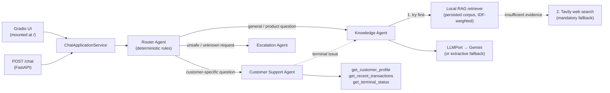

# Getnet Multi-Agent Support

Multi-agent customer support system for Getnet: a Router Agent dispatches each message to a
Knowledge Agent (RAG + web search), a Customer Support Agent (deterministic tools), or an
Escalation Agent, exposed via FastAPI and a Gradio UI mounted on the same process. Built as a
timeboxed technical challenge — see `specs/001-multi-agent-support/` for the spec/plan/tasks and
`docs/AI Hardcore Engineer - Multi-Agent Support System.md` for the original brief.

## Run it

```bash
uv sync --frozen
uv run uvicorn getnet_support.entrypoints.http:app --reload
```

Open `http://localhost:8000/` for the Gradio UI, `http://localhost:8000/docs` for the OpenAPI
docs, or call the API directly:

```bash
curl -s http://localhost:8000/health

curl -s -X POST http://localhost:8000/chat \
  -H 'content-type: application/json' \
  -d '{"message": "Minha maquininha não conecta à internet", "user_id": "cliente1988"}'
```

### Tests and quality gate

```bash
uv run pytest
uv run python scripts/quality_gate.py   # --list to see all checks, --check NAME to run one
```

### Docker

```bash
docker build -t getnet-ai-support .
docker run --rm -p 8000:8000 \
  -e TAVILY_API_KEY="$TAVILY_API_KEY" \
  -e GOOGLE_API_KEY="$GOOGLE_API_KEY" \
  getnet-ai-support
```

The app starts and answers correctly with **no provider keys at all** — see [Degraded mode](#degraded-mode-no-provider-keys).

### Environment variables

Copy `.env.example` to a local `.env` and fill in real values — it's loaded automatically at
startup (`entrypoints/settings.py`, via `pydantic-settings`; already gitignored). A real process
environment variable (e.g. `docker run -e VAR=...`) always takes precedence over the `.env` value.
Summary:

| Variable | Purpose | Default when unset |
|---|---|---|
| `GOOGLE_API_KEY`, `GOOGLE_MODEL` | Gemini generation for the Knowledge Agent | Deterministic extractive fallback |
| `GOOGLE_EMBEDDING_MODEL` | Gemini embedding model for semantic RAG | Lexical (IDF term-overlap) retrieval |
| `TAVILY_API_KEY` | Web search for current/external questions | Reports "unavailable", never guesses |
| `APP_ENV`, `LOG_LEVEL`, `LOG_FORMAT`, `SERVICE_NAME` | Structured logging | See `entrypoints/logging.py` |
| `LANGFUSE_*` | Opt-in LLM call tracing (metadata-only) | Tracing disabled |

## Architecture



FastAPI and Gradio both call the same `ChatApplicationService` instance built once in
`entrypoints/http.py` (the composition root) — no internal HTTP hop between the UI and the API.

Clean Architecture layers (enforced by `scripts/validate_architecture.py`):

```text
domain/       Value Objects: Market, Locale, Route, KnowledgeChunk, ChatResult, ... (no framework imports)
application/  Ports (Protocols) + the four agents + ChatApplicationService + guardrails
adapters/     GeminiLLMAdapter, TavilyWebSearchAdapter, LocalKnowledgeRetriever,
              InMemoryCustomerDataAdapter, the persisted corpus
entrypoints/  FastAPI routes, Gradio Blocks UI, Pydantic schemas, logging bootstrap
```

## Agents

- **Router Agent** (`application/router_agent.py`) — regex-based deterministic classification into
  `knowledge` / `customer_support` / `escalation`. Never delegates authorization, guardrails,
  customer-data access, market isolation, or financial operations to an LLM.
- **Knowledge Agent** (`application/knowledge_agent.py`) — RAG-first, web-search-fallback. Tries
  the authoritative Getnet corpus first; whenever it doesn't have enough evidence — because the
  question isn't about Getnet, or the corpus doesn't cover it — it **always** falls back to a real
  Tavily search instead of giving up. No keyword/regex decides *whether* to search the web; only
  evidence does. Grounds every answer in retrieved context; reports insufficient evidence (from
  both sources) instead of guessing.
- **Customer Support Agent** (`application/customer_support_agent.py`) — calls
  `get_customer_profile`, `get_recent_transactions`, `get_terminal_status` against an in-memory
  CRM/settlement/terminal fixture, always scoped to the request's `user_id` (never to text parsed
  from the message).
- **Escalation Agent** (`application/escalation_agent.py`) — the bonus fourth agent. Returns
  `handoff_required=true` for unknown customers, unsupported financial operations (refund,
  chargeback, account cancellation), unavailable web search, or insufficient RAG evidence.
  Messages are reason-specific (`EscalationReason`: unknown customer / unsupported financial
  operation / explicit human request) and add a real BR support channel (`4002-4000`, cited on
  Getnet's own troubleshooting page) when `market=BR`.

**Multi-agent chaining**: "Minha maquininha não conecta à internet" is routed to Customer Support
(`get_customer_profile` + `get_terminal_status`), and when a terminal issue is detected the same
turn chains into the Knowledge Agent for troubleshooting RAG content — one combined answer, visible
in the response's `agents`/`tools` fields and in the UI's execution panel.

## RAG pipeline

```text
official URLs (site.getnet.com.br/ofertas/, /maquininha/*, /pix/, /link-de-pagamento/,
/crediario/, /get-ajuda-*/, www.getnet.net/en)
  → hand-curated chunks with required metadata (id, text, title, source, market, language,
    topic, retrieved_at, volatility)
  → persisted as JSON in adapters/corpus/{getnet_br,getnet_global}.json
  → retrieval, scoped by market before scoring (either strategy below)
  → context assembled from the top chunks → GeminiLLMAdapter (or extractive fallback)
  → answer + sources (title, url, market, retrieved_at, volatility)
```

No vector DB, no live crawling at startup — the corpus is a one-time, committed snapshot (content
gathered via web search against the official domain at implementation time, not scraped live by
the running service). `ofertas/` content (prices, rates, offers) is tagged `volatility: high`; the
Knowledge Agent qualifies its answer and points to the official page instead of asserting a stale
number as current.

Two interchangeable retrieval strategies implement the same `KnowledgeRetrieverPort`:

- **Lexical** (`adapters/knowledge_retriever_local.py`, always available, zero cost) — PT/EN
  stopword-filtered tokenization, then IDF-weighted term overlap. IDF weighting keeps a
  near-universal word like "Getnet" (present in almost every chunk) from outweighing a rare,
  discriminative term like "antecipação" when a query happens to share both.
- **Semantic** (`adapters/knowledge_retriever_semantic.py`, used automatically when
  `GOOGLE_API_KEY` is set) — every chunk is embedded once at startup via
  `adapters/embeddings_gemini.py` (Gemini `batchEmbedContents`, no vendor SDK), then each query is
  embedded and ranked by cosine similarity (`top_k = 3`, minimum score `0.3`). If the embedding
  call fails at startup (bad key, network down), the service logs a warning and falls back to the
  lexical retriever instead of failing to boot — verified with `GOOGLE_API_KEY=invalid`.

Retrieval is always filtered by `market` **before** scoring, so a `BR` request can never surface a
`GLOBAL` chunk or vice versa (tested for both strategies in `tests/unit/test_knowledge_retriever_local.py`,
`test_knowledge_retriever_semantic.py`, and at the API level in `test_chat_api.py`). Language and
market are independent request dimensions: an English question with `market=BR` still answers from
the Brazilian corpus.

## LLM provider and web search

- `LLMPort` (`application/ports.py`) decouples agents from any SDK. `GeminiLLMAdapter` calls the
  Gemini REST API directly via `httpx` (no vendor SDK dependency), with one bounded, jittered retry
  on transient failures (`adapters/retry.py`). No `GOOGLE_API_KEY` → the Knowledge Agent uses a
  deterministic extractive responder instead of ever calling an LLM.
- `WebSearchPort` → `TavilyWebSearchAdapter`, same REST/retry pattern. No `TAVILY_API_KEY`, or a
  failed call, → the agent reports the information as unavailable. Only the free-text question is
  ever sent to Tavily — never `user_id` or customer data.

### Why web search is a mandatory fallback, not a keyword-gated branch

An earlier version decided "is this a current-info question?" with a regex (`weather|forecast|
clima|...`) before ever considering Tavily. That is exactly the kind of brittleness that keeps
breaking in practice — real users found two gaps in one session ("My card machine won't connect to
the internet" not matching a Portuguese-only pattern in the Router, then "quantos graus vai fazer
amanhã em São Paulo?" not matching any literal weather keyword). No fixed keyword list generalizes
to open-ended natural language.

The Knowledge Agent no longer classifies topics at all: it tries the local corpus first (it's
authoritative for Getnet facts) and, whenever the corpus doesn't clear the minimum evidence score —
regardless of *why*, whether the question is about weather, a country's capital, or anything else
not covered by the ~13-chunk corpus — it unconditionally calls Tavily next. Only when **both**
sources come up empty does it report insufficient evidence and let the orchestrator escalate. See
`KnowledgeAgent.handle` in `application/knowledge_agent.py` and the regression tests in
`tests/unit/test_knowledge_agent.py`, which assert both directions: a good RAG match never touches
web search (no wasted Tavily calls), and anything RAG can't answer always does.

### Degraded mode (no provider keys)

The service starts and answers every scenario with **zero** environment variables set: product
questions get an extractive answer quoting the top retrieved chunk; questions the corpus can't
answer get an explicit "unavailable" message instead of a Tavily call; customer-data questions are
unaffected (they never touch an LLM). Nothing is ever fabricated.

## Guardrails

All deterministic, never delegated to an LLM (`application/guardrails.py` plus structural rules in
the agents):

- Customer tools are always scoped to the request's `user_id`; text in the message body is never
  parsed as a customer identifier.
- Market filtering happens before retrieval scoring — BR/GLOBAL chunks never mix.
- A regex guardrail routes unsupported, state-changing financial requests (refund, chargeback,
  account cancellation) straight to Escalation.
- The Knowledge Agent only answers from retrieved context; below a minimum relevance score it
  reports insufficient evidence rather than guessing, and the orchestrator marks
  `handoff_required=true`.
- An unknown `user_id` raises `CustomerNotFoundError` from the data port and is escalated — never
  answered with placeholder or inferred customer data.
- Retrieved chunks and web-search results are explicitly framed to the LLM as **untrusted data,
  not instructions** — the system prompt tells it to ignore any command embedded inside a chunk or
  search result (basic prompt-injection defense; see `_UNTRUSTED_CONTENT_GUARDRAIL` in
  `knowledge_agent.py`).

## UI

Gradio Blocks (`entrypoints/ui_gradio.py`), mounted on the FastAPI app at `/`. Lets you pick a fake
`user_id` (`cliente1988`, `cliente2001`, or type your own to see escalation), a language (pt-BR /
en), and a market (BR / GLOBAL); shows the answer, cited sources (with volatility markers), a
handoff badge, the route, the agent chain, the tools called, latency, and a trace ID — all labels
bilingual (pt-BR / en). Built-in loading state on submit; an error state (never a raw traceback)
if `chat_service.handle` raises unexpectedly. The red accent and "Getnet" wordmark are a best-effort
approximation of the dominant color observed on `getnet.net/en` (icon/asset naming read as
red-on-white) — no brand-guideline document was available, so this is inspired by, not copied
from, an official asset.

## Bilingual behavior

`locale` is optional on `POST /chat`; when absent it is heuristically detected from the message
(`entrypoints/locale_detection.py`). Response templates (customer-support answers, escalation
messages, RAG/web-search headers and fallbacks) exist in both `pt-BR` and `en`; the LLM system
prompt also carries an explicit "respond in {locale}" instruction. The one caveat: in **degraded
mode** (no LLM key), the extractive fallback quotes the retrieved chunk's original language
verbatim rather than translating it — full bilingual fidelity requires `GOOGLE_API_KEY`.

## Tests

```bash
uv run pytest
```

73 tests, 93% coverage, no real network (Gemini/Tavily/embedding calls use `httpx.MockTransport`
or fake ports — see `tests/unit/test_llm_gemini.py`, `test_web_search_tavily.py`,
`test_embeddings_gemini.py`, `test_chat_api.py`). Covers: the full `POST /chat` contract,
product-question RAG with sources (lexical and semantic), web-search success and "unavailable"
fallback, the settlement and terminal-status tools, the terminal → RAG chain, unknown user →
escalation with no fabricated data, reason-specific escalation messages, PT/EN responses, BR/GLOBAL
market isolation in both directions (for both retrieval strategies), unsupported-financial-operation
escalation, and `/health` / `/` smoke tests.

### Evaluation dataset

`evaluation/scenarios.json` holds the challenge brief's own 10 example scenarios (verbatim), each
with an expected route/tool/handoff outcome. `tests/unit/test_eval_scenarios.py` runs every one of
them against the wired system as a parametrized regression test — this is what caught a real router
bug during implementation (the English phrasing "My card machine won't connect to the internet"
was silently misrouted to the Knowledge Agent instead of Customer Support; fixed in
`router_agent.py`). Extend the dataset by adding entries to the JSON file — no code changes needed.

## Limitations and evolution to production

- **Semantic retrieval** re-embeds the whole corpus at every process startup (one batched call,
  ~13-16 chunks) rather than caching vectors to disk — fine for this corpus size, but a production
  deployment with a larger or frequently-changing corpus would persist embeddings and only
  re-embed changed chunks.
- **Corpus** is a hand-curated snapshot (gathered via web search at implementation time, not a live
  crawl), not a scheduled ingestion pipeline. Production would add a periodic re-ingestion job with
  content diffing and a review step before republishing `volatility: high` content.
- **Customer data** is an in-memory fixture (`cliente1988`, `cliente2001`). Production would swap
  `CustomerDataPort` for real CRM/settlement/terminal adapters behind the same interface — no
  agent code changes.
- **New runtime dependencies** (`fastapi`, `gradio`, `httpx`, `uvicorn`) were reviewed by the
  automated `pip-audit` gate only, not a manual license/provenance review, given the timebox.
- **Observability** is structured logs plus the response's own trace metadata
  (`trace_id`/`route`/`agents`/`tools`/`sources`/`latency_ms`/`handoff_required`); no external
  tracing stack. Langfuse call tracing exists as an opt-in, metadata-only seam
  (`adapters/tracing.py`) but isn't wired into the LLM adapter yet.
- **No conversation memory** across requests; each `POST /chat` is stateless by design.
